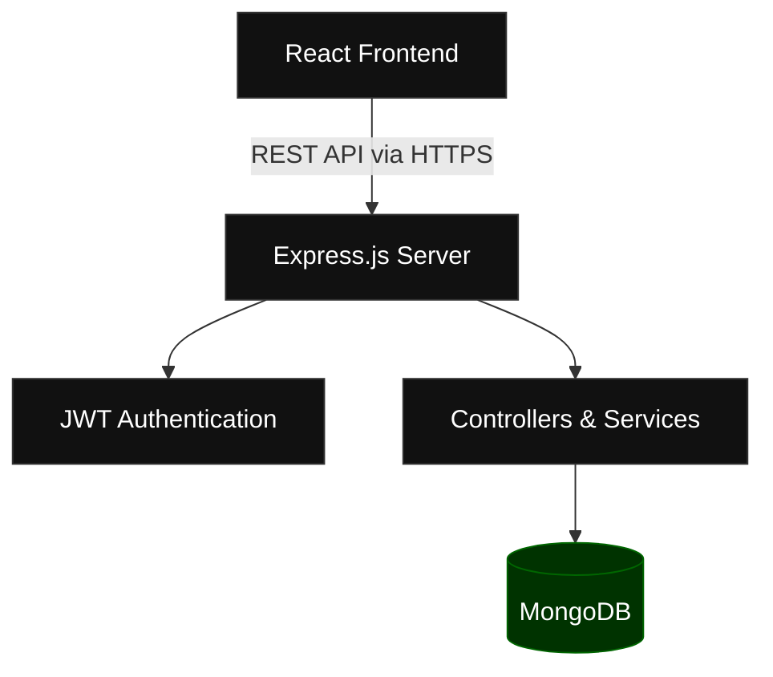

```markdown
<div align="center">
  

  <h1>InnFlow</h1>
  
  <p><strong>Modern Hotel Operations & Booking Platform</strong></p>
  
  <p>A comprehensive, digital-first solution designed to streamline hotel administration and elevate the guest booking experience.</p>

  <p>
    <a href="#">Live Demo</a> •
    <a href="#">Documentation</a> •
    <a href="#">Report Issue</a> •
    <a href="#">Request Feature</a>
  </p>
</div>

---

## 🛑 The Problem

Small and medium-sized hotels are often bogged down by inefficient, manual workflows. Guests frequently resort to calling reception just to check room availability, leading to bottlenecks and crowded lobbies during peak check-in hours. 

Behind the desk, administrative staff spend countless hours maintaining physical booking ledgers or fragmented spreadsheets. This reliance on manual entry inevitably introduces human error, duplicate reservations, and disconnected availability data across different channels.

## ✨ The Solution

InnFlow digitizes and centralizes these critical operations into a single, cohesive platform. 

By eliminating manual ledgers, InnFlow empowers both guests and managers with synchronized, real-time data. Guests enjoy a frictionless, self-serve booking experience from any device, while management benefits from automated availability tracking, streamlined administration, and a drastic reduction in repetitive administrative tasks.

---

## 🚀 Key Features

### Guest Experience
* **Live Availability Engine:** Real-time room status checking without calling reception.
* **Seamless Discovery:** Browse room types, amenities, and high-quality imagery.
* **Booking History:** Dedicated guest portal to view past and upcoming stays.

### Administration
* **Centralized Dashboard:** A command center for all hotel operations.
* **Inventory Control:** Manage rooms, pricing, and availability states effortlessly.
* **Customer Management:** Maintain detailed profiles and stay histories for all guests.

### Booking & Operations
* **Digital Reservations:** Secure, error-free online booking flow.
* **Conflict Prevention:** Automated double-booking protection.
* **QR Check-in:** Frictionless, contact-free arrival experience.

### Authentication
* **Secure Access:** JWT-based authentication for guests and administrators.
* **Role-Based Permissions:** Strict access control separating management from public users.

---

## 🖼️ Interface

<div align="center">
  
  
</div>
<br />
<div align="center">
  
  
</div>

---

## 🏗️ System Architecture



---

## 💻 Technology Stack

### Frontend


### Backend


### Database


---

## 🏁 Getting Started

### Prerequisites
* Node.js (v18 or higher)
* MongoDB instance (local or Atlas)

### 1. Clone the repository
```bash
git clone https://github.com/yourusername/innflow.git
cd innflow
```

### 2. Install Dependencies
```bash
# Install server dependencies
cd server
npm install

# Install client dependencies
cd ../client
npm install
```

### 3. Environment Variables
Create a `.env` file in the `server` directory:
```env
PORT=5000
MONGODB_URI=your_mongodb_connection_string
JWT_SECRET=your_highly_secure_jwt_secret
```

### 4. Run the Application
```bash
# Start the Express server (from the server directory)
npm run dev

# Start the React frontend (from the client directory)
npm start
```

---

## 📂 Project Structure

```text
innflow/
├── client/                 # React Frontend
│   ├── public/
│   └── src/
│       ├── assets/         # Images, icons, and global styles
│       ├── components/     # Reusable UI components
│       ├── pages/          # Main application views
│       ├── services/       # API integration layers
│       └── utils/          # Helper functions
│
└── server/                 # Express Backend
    ├── controllers/        # Request handling logic
    ├── middleware/         # Auth and validation checks
    ├── models/             # Mongoose database schemas
    ├── routes/             # API endpoint definitions
    └── utils/              # Server-side utilities
```

---

## 🗺️ Future Roadmap

- [ ] **Payment Integration** (Stripe/PayPal for automated deposits)
- [ ] **Email Notifications** (Automated booking confirmations and reminders)
- [ ] **Advanced Analytics** (Occupancy rates and revenue reporting)
- [ ] **Multi-Hotel Support** (Manage several properties from one account)
- [ ] **Mobile Application** (Native app for on-the-go management)

---

## 🤝 Contributing

We welcome contributions to make InnFlow even better. Please review our [Contributing Guidelines](CONTRIBUTING.md) before submitting pull requests.

## 📄 License

This project is licensed under the MIT License - see the [LICENSE](LICENSE) file for details.
```
