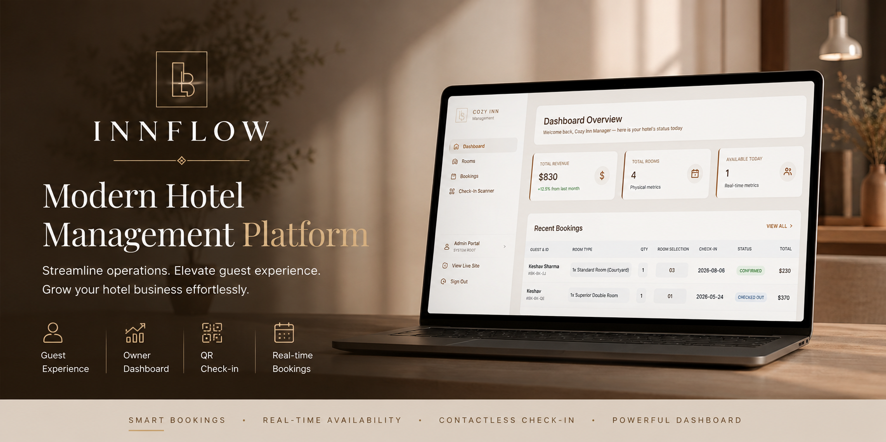
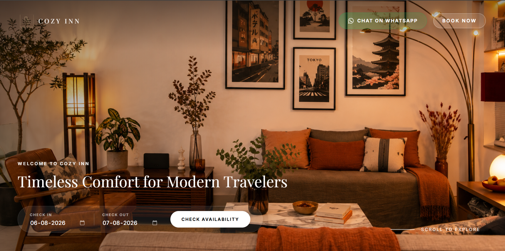
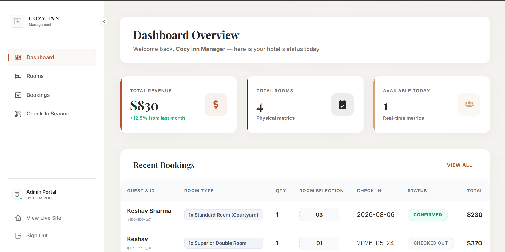
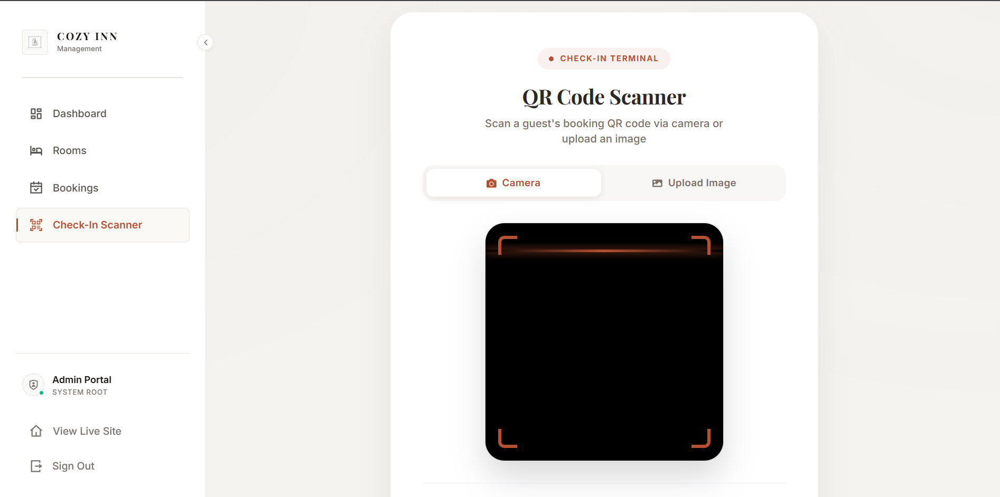
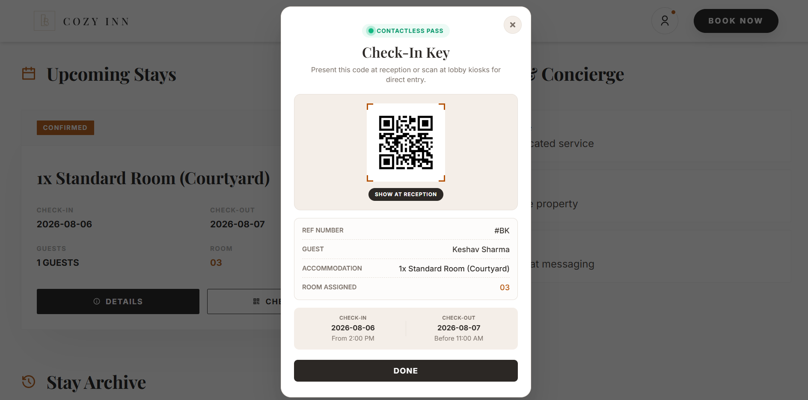
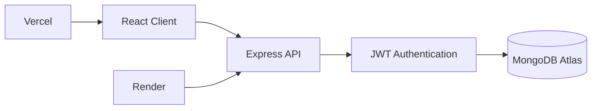
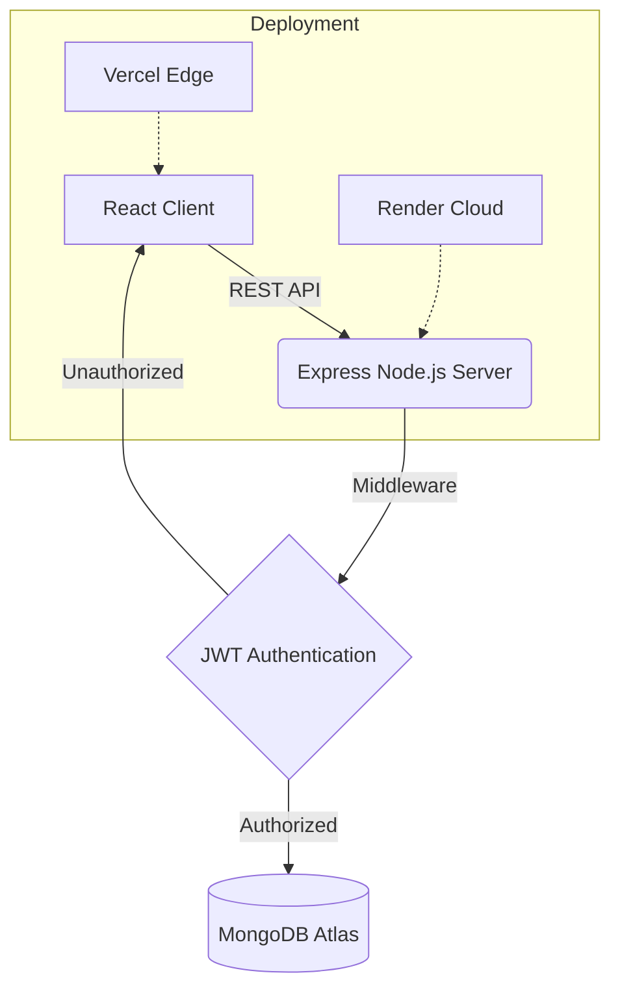

<div align="center">
  

  <h1>InnFlow</h1>
  <p><strong>A Premium Boutique Hotel Management & Booking Platform</strong></p>

  <p>
    <a href="https://thecozyinn.vercel.app"></a>
    <a href="https://github.com/keshavsharma05/innflow"></a>
  </p>
</div>

<br />

## Overview

InnFlow is a headless booking engine and property management system designed exclusively for boutique hotels and luxury accommodations. It provides a seamless, cinematic guest experience while giving property owners a powerful suite of operational tools. 

By eliminating the friction of traditional hotel software, InnFlow solves the dual problem of modern hospitality: delivering a flawless digital booking journey while automating backend operations like inventory synchronization and contactless check-ins.

---

## Preview

<table width="100%">
  <tr>
    <td width="50%" align="center">
      
      <br />
      <em>Luxury Guest Experience</em>
    </td>
    <td width="50%" align="center">
      
      <br />
      <em>Owner Dashboard</em>
    </td>
  </tr>
  <tr>
    <td width="50%" align="center">
      
      <br />
      <em>QR Check-In</em>
    </td>
    <td width="50%" align="center">
      
      <br />
      <em>Digital Guest Pass</em>
    </td>
  </tr>
</table>

---

## How InnFlow Works


---

## Features

<table width="100%">
  <tr>
    <td width="50%">
      <strong>Luxury Guest Experience</strong><br />
      Cinematic scrolling, dynamic cart functionality, and premium UI elements powered by GSAP and Lenis.
    </td>
    <td width="50%">
      <strong>Owner Dashboard</strong><br />
      Centralized command center for managing reservations, analyzing capacity, and overseeing property inventory.
    </td>
  </tr>
  <tr>
    <td width="50%">
      <strong>Real-Time Availability</strong><br />
      Intelligent date querying against MongoDB to prevent overbooking and accurately calculate inventory.
    </td>
    <td width="50%">
      <strong>QR Check-In</strong><br />
      Built-in hardware-agnostic QR scanning engine for immediate guest verification at the front desk.
    </td>
  </tr>
  <tr>
    <td width="50%">
      <strong>JWT Authentication</strong><br />
      Secure, role-based access control protecting administrative routes and sensitive operational data.
    </td>
    <td width="50%">
      <strong>Booking Management</strong><br />
      Automated lifecycle transitions from reservation to check-in, check-out, and memory archiving.
    </td>
  </tr>
</table>

---

## Architecture



---

## Tech Stack

<table width="100%">
  <tr>
    <td width="33%">
      <strong>Frontend</strong><br />
      React 19<br />
      Vite<br />
      GSAP & Lenis
    </td>
    <td width="33%">
      <strong>Backend</strong><br />
      Node.js<br />
      Express 5<br />
      Node-cron
    </td>
    <td width="33%">
      <strong>Database</strong><br />
      MongoDB Atlas<br />
      Mongoose ODM
    </td>
  </tr>
  <tr>
    <td width="33%">
      <strong>Authentication</strong><br />
      JSON Web Tokens (JWT)<br />
      Bcrypt<br />
      Role-Based Access
    </td>
    <td width="33%">
      <strong>Deployment</strong><br />
      Vercel (Frontend)<br />
      Render (Backend)
    </td>
    <td width="33%">
      <strong>Developer Tools</strong><br />
      ESLint<br />
      Nodemon<br />
      Dotenv
    </td>
  </tr>
</table>

---

## Project Structure

* **`/public`** — Contains static assets, brand imagery, and the dynamically generated HTML5 QR configurations.
* **`/server`** — The decoupled Node.js API environment containing all business logic, cron jobs, and database schemas.
* **`/server/models`** — Mongoose data models defining the strict shape of Users, Rooms, and Bookings.
* **`/server/controllers`** — Dedicated handlers that isolate the request logic from routing definitions.
* **`/src`** — The Vite React frontend application.
* **`/src/app/admin`** — Protected components exclusively for the property owners (Dashboard, Scanner, Management).
* **`/src/marketing`** — High-performance, SEO-optimized landing pages designed for conversion.
* **`/src/services`** — Abstracted API fetchers and Context API providers for global state management.

---

## API Overview

### Authentication
* `POST /api/auth/verify-otp` — Authenticates guests and issues tokens.
* `POST /api/auth/admin-login` — Authenticates property administrators.

### Rooms
* `GET /api/rooms/:hotelId` — Retrieves property-specific room configurations.

### Bookings
* `GET /api/bookings/availability/:hotelId` — Queries room availability by date range.
* `POST /api/bookings` — Instantiates a new reservation and reduces inventory.
* `GET /api/bookings?phone=` — Retrieves the historical archive for a guest.

### Admin & QR
* `PATCH /api/bookings/:id` — Mutates the lifecycle state of a reservation.
* `POST /api/bookings/scan-qr` — Interprets a Digital Pass payload and validates entry.

---

## Security

* **JWT:** Stateless authentication tokens with strict expiration windows.
* **Password Hashing:** Administrative credentials are encrypted via Bcrypt prior to storage.
* **Protected Routes:** Both React Router components and Express endpoints implement role-based guards.
* **Validation:** Express payloads are sanitized and limited to `10kb` to mitigate DoS vulnerabilities.
* **Environment Variables:** All secrets and URIs are injected at runtime via `.env`.
* **CORS:** Cross-Origin Resource Sharing is strictly whitelisted to approved deployment domains.

### Frontend (Client)
* **Framework:** React 19 + Vite
* **Routing:** React Router v7
* **State Management:** React Context API (`AuthContext`, `HotelContext`)
* **Styling:** Modular Vanilla CSS tailored for custom design tokens and fluid typography.
* **Animation:** GSAP (GreenSock) & Lenis (Smooth Scroll)
* **Utilities:** `react-icons`, `html5-qrcode`

## Local Development

### 1. Clone
```bash
git clone https://github.com/keshavsharma05/innflow.git
cd innflow
```

### 2. Install Dependencies
```bash
npm install
cd server && npm install
```

### 3. Environment Variables
Create a `.env` in `/server`:
```env
PORT=5000
MONGODB_URI=mongodb://localhost:27017/hotel_booking
JWT_SECRET=your_jwt_secret
ADMIN_USER=admin
ADMIN_PASS=123
FRONTEND_URL=http://localhost:5173
```

### 4. Run Backend
```bash
cd server
npm run seed
npm run dev
```

### 5. Run Frontend
Open a new terminal session:
```bash
npm run dev
```

---

## Deployment

* **Frontend:** Configure Vercel to target the root directory and use `npm run build`. Set the `VITE_API_URL` environment variable to the deployed backend URL.
* **Backend:** Deploy as a Web Service on Render targeting the `server/` root. Ensure `NODE_ENV=production` is set.
* **Database:** Provision a MongoDB Atlas cluster, whitelist the Render outbound IP addresses, and inject the connection string into the backend environment.

---


## License

MIT

---

<div align="center">
  <p>Built by <strong>Keshav Sharma</strong></p>
  <p>
    <a href="https://github.com/keshavsharma05">GitHub</a> • 
    <a href="https://linkedin.com/in/keshavsharma05">LinkedIn</a> • 
    <a href="https://keshavsharma.dev">Portfolio</a>
  </p>
</div>
